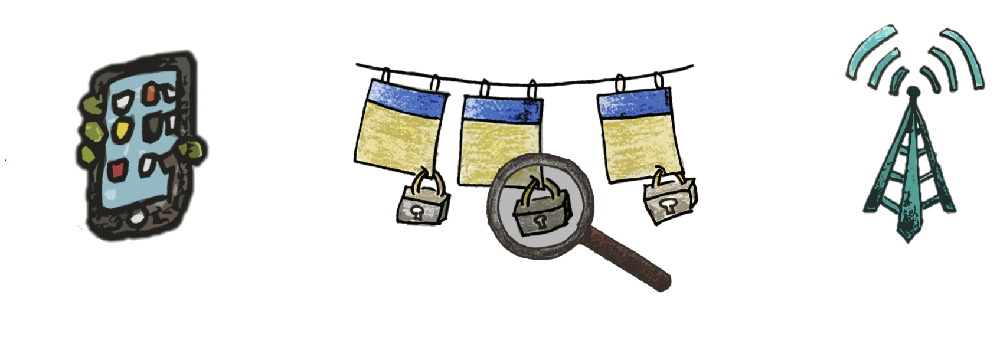
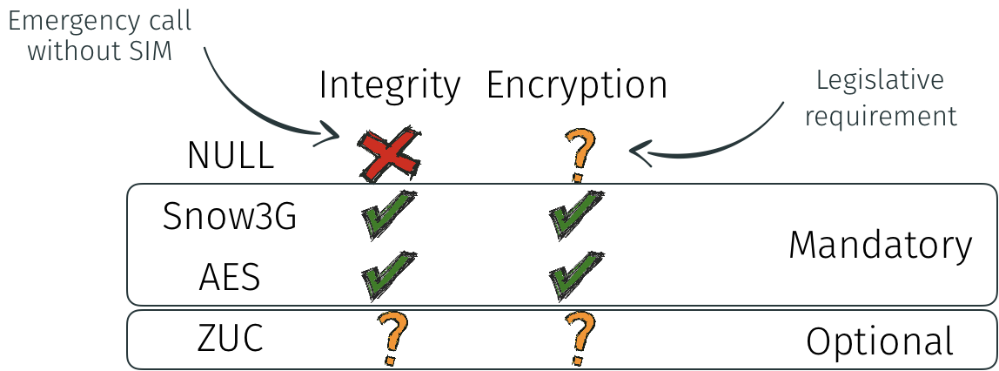
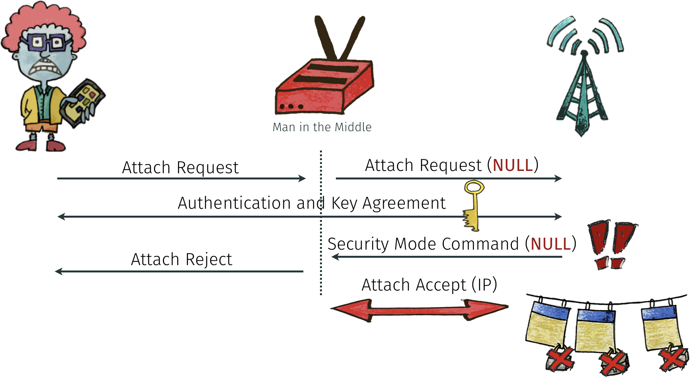
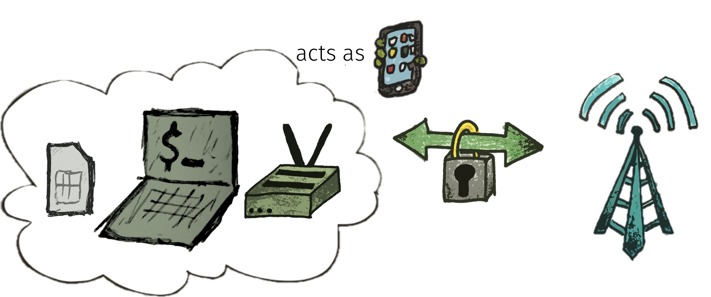
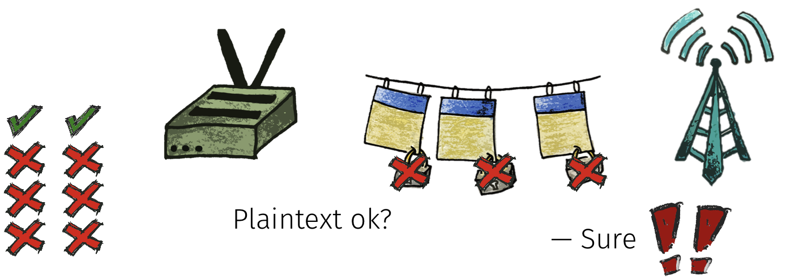

note: the tool is based on an old version of srsRAN (20.04). for best experience, I suggest using the most recent srsRAN version. it now includes the option to change the UE cipher support.

---

td;dr: we found that several European LTE networks allow unprotected connections (no encryption, no integrity protection). Attackers can intercept the authentication step from nearby users and get Internet access at the victim's cost. This tool quickly tests LTE networks for their cipher support. It's for use by telecom operators only.

Operators should ensure that:
* EIA0 (NULL-Integrity) is never accepted
* invalid UE security capabilities (e.g., empty field) don't cause fallbacks to NULL-Integrity.
* EEA0 should be disabled

The tool connects to the LTE network, each time with a different 'UE Security Capabilities'. If the network accepts an insecure configuration, the tool prints a warning. Example output:
```
$ sudo ./srsue/src/srsue ../srsue/ciphercheck.conf
...
########################################################
 Testcase Finished. EIA: 00001111 EEA: 00001010
 Summary: 
UE Security Capabilities: Encryption Integrity
                 NULL   :     -          x    
                 Snow3G :     x          x    
                 AES    :     -          x    
                 ZUC    :     x          x    
Received Messages: 
  * NAS Security Mode Command: EEA=EEA0, EIA=128-EIA1
  * RRC Security Mode Command: EEA=EEA0, EIA=128-EIA2
  * Attach Accept
Potential issues: 
  * Insecure ciphering algorithm on NAS: EEA0
  * Insecure ciphering algorithm on RRC: EEA0
  * Security Capabilities mismatch in NAS Security Mode Command: EEA=EEA0, EIA=128-EIA1
  * Security Capabilities mismatch in RRC Security Mode Command: EEA=EEA0, EIA=128-EIA2
  * Integrity algorithm mismatch between NAS (128-EIA1) and RRC (128-EIA2)
```

You can reach me at [merlin.chlosta+eia0@rub.de](mailto:merlin.chlosta+eia0@rub.de), always happy for feedback!

## LTE Security Disabled—Misconfiguration in Commercial Networks.

Check out our research paper and talk at WiSec 2019 ([Paper](./img/wisec19-final123.pdf), [Talk](./img/WiSec19-LTE_Security_Disabled.pdf)):
> Merlin Chlosta, David Rupprecht, Thorsten Holz, and Christina Pöpper. 2019. LTE Security Disabled—Misconfiguration in Commercial Networks. In 12th ACM Conference on Security and Privacy in Wireless and Mobile Networks (WiSec ’19), May 15–17, 2019, Miami, FL, USA. ACM, New York, NY, USA, 6 pages. https://doi.org/10.1145/3317549.3324927

Im summary, we found that:
* 4/12 networks were misconfigured
* 3/12 networks directly allowed impersonation

### Encryption in LTE Networks

LTE networks protect user traffic and control data with encryption, and additionally integrity-protect control data. We're going to have a look at the method that is used for securing the data.



There are multiple ciphers available, thus, smartphone and network need to negotiate which one to use. Snow3G, AES and ZUC actually protect the messages. However, there's a 'NULL' algorithm for testing purposes and emergency calls -- it does not provide any protection.



Networks and smartphones must support AES and Snow3G. ZUC is optional. The NULL algorithm may only be selected for emergency purposes.

### Impact of Misconfigurations

If a network is poorly configured and allows NULL algorithms, man-in-the-middle attacks become trivial. If a network accepts unprotected connections, attackers can impersonate benign users. That means, the attacker get's an IP address, while the unaware user pays for the data.



Due to roaming, your users might be affected even if your network is properly configured; attackers can authenticate to vulnerable roaming partner networks.

## Setup

The whole setup looks like this:



We use Ettus USRP B210 as Software Defined Radio, and the smartcard readers that are built into the Dell standard keyboards. Any other SDR that is supported by srsLTE will work, too.

### Installation

You can install LTE-ciphercheck locally, just like srsLTE.

Dependencies:
```console
sudo apt install git cmake libfftw3-dev libmbedtls-dev libboost-program-options-dev libconfig++-dev libsctp-dev libuhd-dev libpcsclite-dev pcsc-tools pcscd
```

Build:
```console
git clone https://github.com/mrlnc/LTE-ciphercheck
cd LTE-ciphercheck
mkdir build && cd build
cmake ..
make -j `nproc` srsue
```

## Configuration

Create a config file:
```config
cp srsue/ciphercheck.conf.example srsue/ciphercheck.conf
```

Fill out all blanks with the proper values. These are the minimum required parameters. Your network may require additional settings, such as APN authentication.
```
dl_earfcn = ${DL_EARFCN}
imei = ${IMEI}
apn = ${APN}
```

### Advanced Configuration & ZMQ

LTE-ciphercheck build with [srsLTE](https://github.com/srsLTE/srsLTE) with minor changes. See the [srsLTE README](https://github.com/srsLTE/srsLTE/blob/master/README.md) for detailed build instructions, and [www.srslte.com](srslte.com) for documentation and guides.

Note that for local testing without radio hardware, you can use the [ZMQ support in srsLTE.](https://docs.srslte.com/en/latest/app_notes/source/zeromq/source/)

## Usage

Run LTE-Ciphercheck:
```
cd build
sudo ./srsue/src/srsuee ../srsue/ciphercheck.conf
```

Options:
* `--fast-test` (default: `true`)
  * skip tests with AES or Snow3G enabled, probably, the network will just select those standard algoritms.
* `--always-test-connection` (default: `false`)
  * perform a connection test between each test case.

## Results

After running, the results are stored in `/tmp/results`. The main result log file is `log/results.log`.

### Accepted Cipher

```
10:31:58.928076 [Main] [I] New Testcase 2 with EIA 00001111 EEA 00001111
10:32:00.039133 [Main] [I] Testcase 2 got NAS Security Mode Command. Integrity: 128-EIA2, Ciphering: 128-EEA2
10:32:00.574756 [Main] [I] Testcase 2 got RRC Security Mode Command. Integrity: 128-EIA2, Ciphering: 128-EEA2
10:32:00.574806 [Main] [I] RRC encryption key - k_rrc_enc
             0000: 7d a9 26 c6 c9 6c 27 af 34 f5 e4 0f b0 47 f5 2f 
             0010: 4a 1a c4 71 ed f4 bc 43 c1 a6 d5 f7 b4 a4 55 cd 
10:32:00.574813 [Main] [I] RRC integrity key - k_rrc_int
             0000: c0 de c2 df 3a 2c 08 b1 76 fc d2 c5 cc 9d 11 31 
             0010: 24 3a e3 b5 79 2a 34 95 cc 68 2d 3a 9e 16 1b 87 
10:32:00.574816 [Main] [I] UP encryption key - k_up_enc
             0000: f3 0d 8d e4 9b 4a 42 80 ae 86 90 8a ec 32 4c 19 
             0010: 8d 8e cc e2 08 ff 0e 12 3b 49 ae 2d 01 9d 1d 68 
10:32:00.588104 [Main] [I] Testcase 2 got Attach Accept
10:32:01.678156 [Main] [I] UE Security Capabilities: Encryption Integrity
                 NULL   :     x          x    
                 Snow3G :     x          x    
                 AES    :     x          x    
                 ZUC    :     x          x    
Received Messages: 
  * NAS Security Mode Command: EEA=128-EEA2, EIA=128-EIA2
  * RRC Security Mode Command: EEA=128-EEA2, EIA=128-EIA2
  * Attach Accept
Potential issues: 
 -- no issues -- 
```
 RRC keys are useful for reading the MAC-layer PCAP with encrypted PDCP.

### Rejected Cipher

```
09:09:58.797989 [Main] [I] New Testcase 15 with EIA 00001001 EEA 00000001
09:09:59.745830 [Main] [I] Testcase 15 got Attach Reject, cause: MME_EMM_CAUSE_PROTOCOL_ERROR_UNSPECIFIED
09:10:00.833074 [Main] [I] UE Security Capabilities: Encryption Integrity
                 NULL   :     x          x    
                 Snow3G :     -          -    
                 AES    :     -          -    
                 ZUC    :     -          x    
Received Messages: 
  * Attach Reject
Potential issues: 
 -- no issues -- 
```

In this test case, the cipher selection for integrity protection is 00001001, that is, EIA-ZUC (0b1000) and EIA-NULL (0b0001) only. For encryption, only NULL (0b0001) is allowed. The network should not accept such configuration. In this example, the network is properly configured and rejects the connection.

## Testing Procedure

When the UE starts the connection procedure, it will transmit a list of supported ciphers. The network then selects one of these, based on it's own capabilities. If there's no match, or some policy prohibits some cipher (e.g., NULL), the network must reject the connection attempt.

For example, if the UE signals only NULL ciphers for encryption and integrity protection, the network should not establish a connection as in this example:


We perform one connection setup for each possible combination of ciphers and check whether the network accepts or denies. Since there are 256 combinations, a single test run performs at least that many attaches to the network.

## Credits

srsLTE is a free and open-source LTE software suite developed by SRS (www.softwareradiosystems.com). See [www.srslte.com](srslte.com) for documentation, guides and project news. srsLTE is released under the AGPLv3 license and uses software from the [OpenLTE project](http://sourceforge.net/projects/openlte) for some security functions and for NAS message parsing.

[Katharina Kohls](https://kkohls.org) allowed me to use the pictograms, taken from her research papers or presentations. Thanks!

## Disclaimer

> the software is provided “as is”, without warranty of any kind, express or implied, including but not limited to the warranties of merchantability, fitness for a particular purpose and noninfringement. in no event shall the authors or copyright holders be liable for any claim, damages or other liability, whether in an action of contract, tort or otherwise, arising from, out of or in connection with the software or the use or other dealings in the software.

srsLTE and LTE-ciphercheck might not stick to the LTE standard and break your network.
